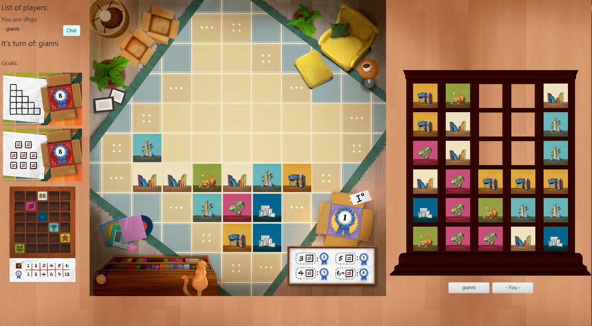
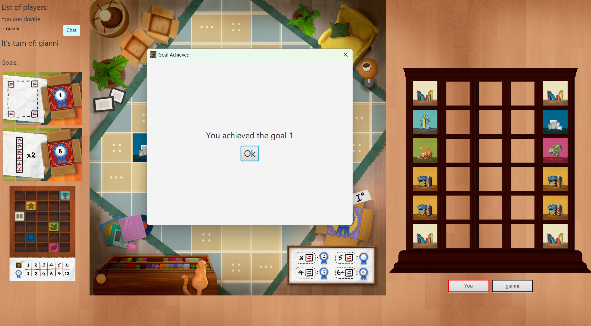
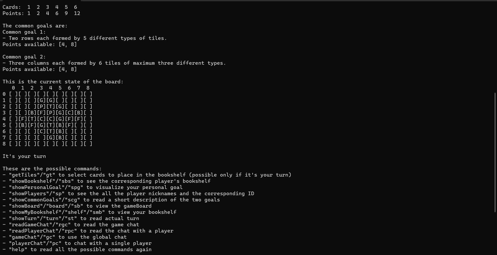
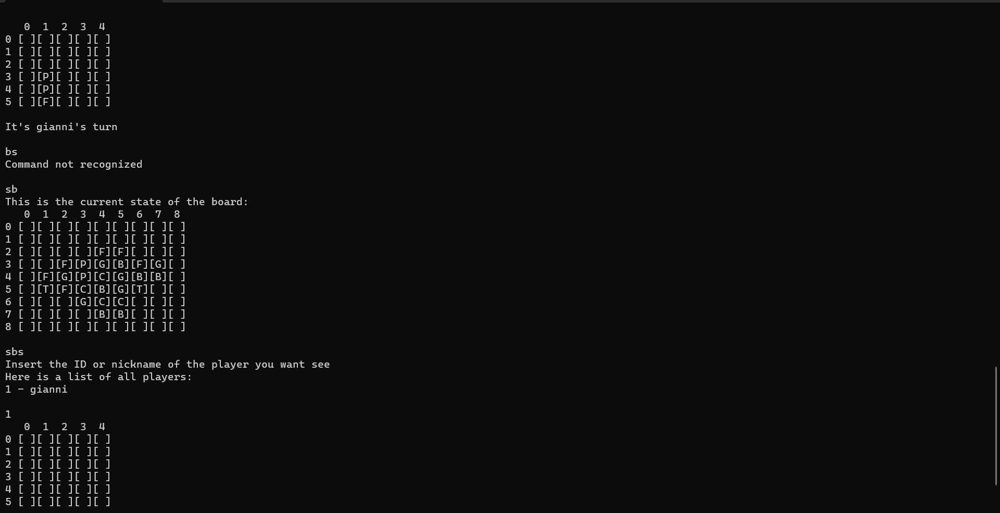

# MY SHELFIE - Software Engineering Project

This game was developed as a computer game for the final examination of the Software engineering course at Politecnico di Milano (A.Y. 2022/2023) 
<br>
## Game Introduction
You’ve just taken home your new bookshelf, and it’s now time
to put your favourite items in display: books, board portraits… Who will show the most organized shelfie?

## Group members
- **Gaetano Giambra** <br>
- **Sara Naima D'Angelo** <br>
- **Davide Cattivelli** <br>

## Project Requirements
Develop an online multiplayer board game with Java using the MVC pattern.<br>
We developed the server and the client, with both CLI and GUI (JavaFX) interfaces.<br>
To transmit data we used TCP protocol between server and clients along with JSON format and Java serialization.<br><br>

## Screenshots

## Gui 
<br> <br>

<br> <br>

 <br>

## Cli

 <br>

 <br>


## Functionalities Implemented

| Functionality                |                        State                         |
|:-----------------------------|:----------------------------------------------------:|
| Simple rules                 | [](#) |
| Complete rules               | [](#) |
| Socket                       | [](#) |
| CLI                          | [](#) |
| GUI                          | [](#) |
| Multiple games               |  [](#)  |
| Persistence                  |  [](#)  |
| Resilience to disconnections |  [](#)  |
| Chat                         | [](#) |

## Execution of the jar file
To execute the application you'll need to download the TopipDiLibreria.jar

### *Server*
To execute the **Server**  insert the following command into the terminal:
``` 
java -jar TopipDiLibreria.jar --server
``` 

### *Client*
To execute the **Client with GUI** insert the following command into the terminal, followed by the IP address of the server:
``` 
java -jar client.jar --gui "IP server"
``` 

To execute the **Client with CLI**  insert the following command into the terminal, followed by the IP address of the server:
```
java -jar client.jar --cli "IP server"
``` 
you can also execute the **Client with CLI** with this command: 

```
java -jar client.jar "IP server"
``` 
<!--
[](#)
[](#)
[](#)
-->
